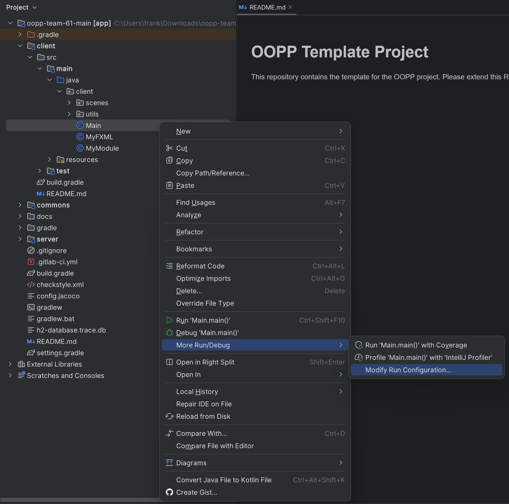
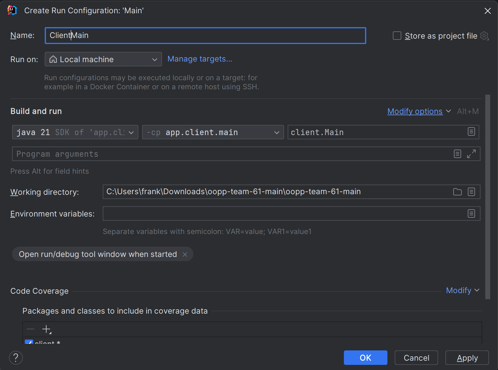
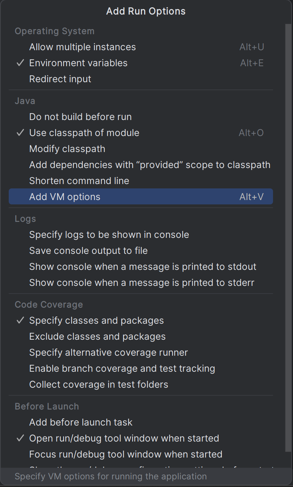
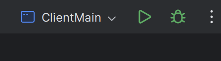
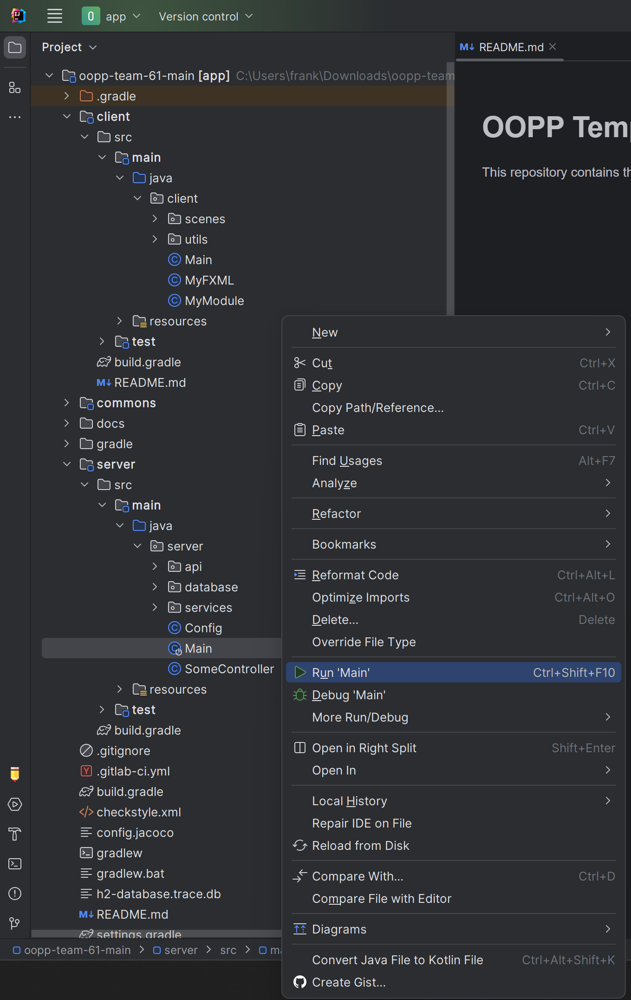
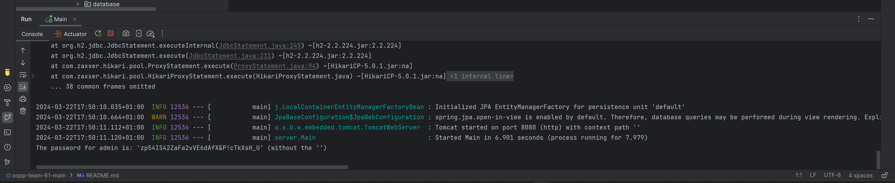
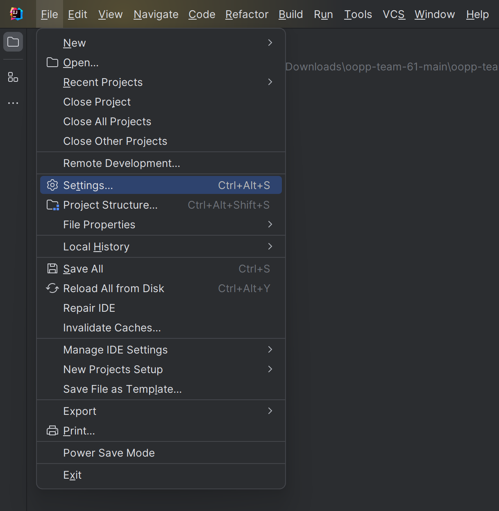
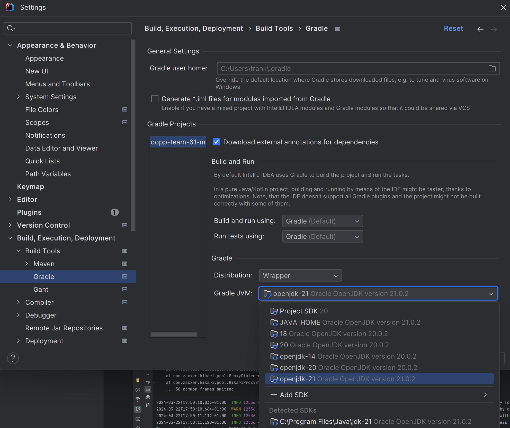
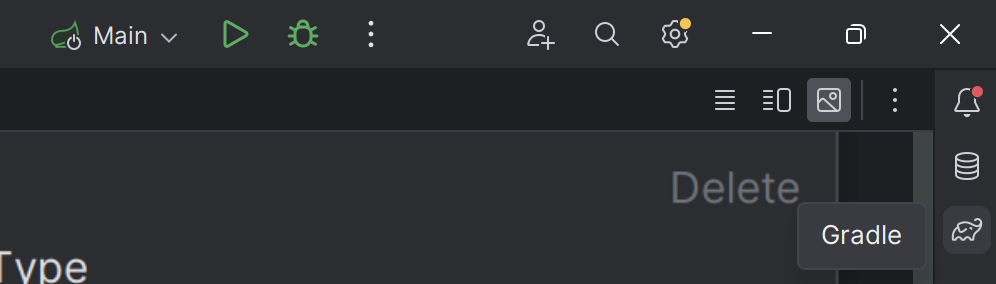
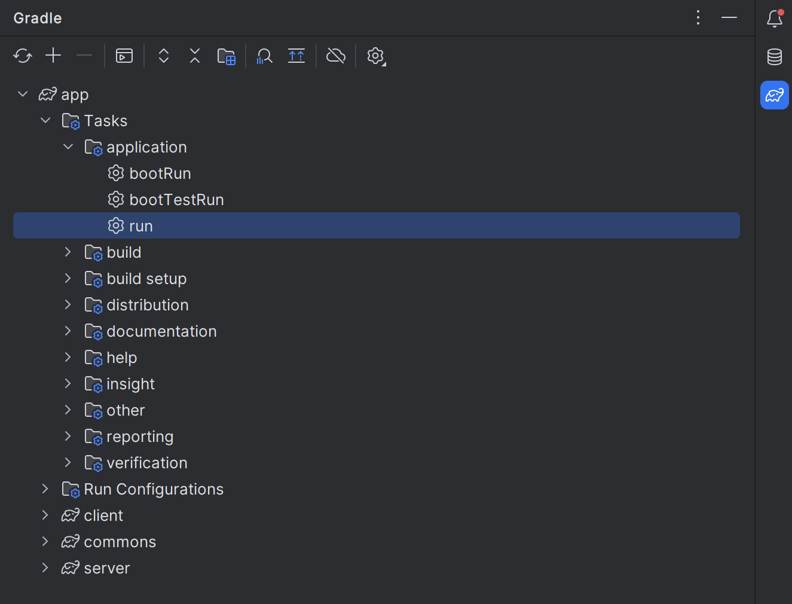

# OOPP Template Project

# Features:
- Connect to a server of your choice
- Create a profile on the app 
- Choose the language you want the app to be in (choice persists throughout multiple sessions)
- Create a language of your own choosing for the app to be in
- Create an event
- Join an event via an invite code
- Send others an email (through the app) with the invite code to a certain event
- Edit an event participant's information
- Remove a participant from an event
- Add an expense to an event (specify who made the payment and a list of people who benefitted from that payment)
- Within an event, see a list of debts between people which were made as a result of the created expenses
- Add a tag to an expense (there are three basic tags, but a user can add other tags - tags have a name and a color)
- Edit the details of an expense (people who participated in it or the amount paid or its description or any other detail)
- Within an event, see a statistics page (with a pie chart) which reflects the amount of money spent on different categories (tags) and also how much each person in the group owes/is owed
- In the home page you can see all events and expenses you are part of
- You can download a language template - a list of all the words used in throughout the app - which you can fill and send to the developers so it can be added in the next patch
- As a user, you can go to the settings page where :
  - You can change your first name and last name
  - You can configure your email: you can just write the address or if you want the app to send emails on your behalf, you can also write the password for the email, the smtp and the port number (in the bottom of the page you will get confirmation if the app is able to send emails on your behalf)
  - You can change the server you are on
- There is also an admin side of the app:
  - As an admin, you will see a password in the server terminal which can be written in the appropriate field in the home page
  - When logged in to the admin side, you are able to see some information about the servers
  - You can see all of the created events and the number of participants in each of them (this can help to see how populated an event is) - the numbers are updated in real time, via long polling
  - You can sort the events by their name, their creation date and by the date they were last updated (this way, an admin can see when an event is no longer active)
  - You can delete an event 
  - You can create a backup of the event (in JSON format)
  - You can import an event (in JSON format)
  - The import and backup features are used in case an admin deletes an event by accident

# How to run the project
## Software prerequisites:
### How to install Java:
- Java 21(!) https://www.oracle.com/java/technologies/downloads/#java21
- Run java --version and check the output.
- Regardless of which Java JDK you have installed, Gradle will pick up the Java version
from your JAVA_HOME environment variable, so make sure it is set correctly
- Windows (Restart Required!)
https://superuser.com/questions/1057532/how-to-change-java-version-on-windows-10
- MacOS (use 21.0.2 instead of 17.0.1)
https://knasmueller.net/how-to-install-java-openjdk-17-on-macos-big-sur
### How to install JavaFX:
- https://openjfx.io/
- Download (SDK) (Match your Java JDK version)
- Unzip the downloaded SDK .zip somewhere (e.g., /path/to/javafx-sdk/)
- Make sure that this extracted path contains a “lib” folder
- Add VM Arguments to your Run Configs for the Client (note the “lib”!)
- To do this goto client/src/main/java/client and right click Main, click More Run/Debug and click Modify Run Configuration...

- This will Bring you to this menu

- For name put something like ClientMain and than press Modify options (blue link).
This will bring up a menu, select Add VM options from this menu.

- Once you have clicked this there will appear a new textfield VM options where you should put '--module-path="/path/to/javafx-sdk/lib" --add-modules=javafx.controls,javafx.fxml' 
- Make sure to change the /path/to/javafx-sdk/lib to the path of the unzipped javafx SDK and include /lib
- On Windows, you will like need to use backslashes (\) for the path
- Once you have filled this field in click apply and than click ok. If done correctly your configuration should appear in the top right of your screen.
- 

## Actually running the project: 

To Actually run the project follow these two simple steps:
- Go to server/src/main/java/server , rightclick Main and click Run 'Main'

This should start running the server and once you see the admin password in the console that opened up after a few second you can continue to the next step.

- Before running the client you should go to settings, Build, Execution, Deployment, Select Gradle and make sure the Gradle JVM is a jdk-21 (Make sure to click apply)

-Once you have done this you can go to the Gradle elephant icon on the right of your screen and click on app, Tasks, application, run.

- A new window has now opened with the application running!
- If you are using the standard server you can connect to it using localhost and the port 8080 (write 'localhost' for the IP address and '8080' for the port), have fun!
- Do not worry if it takes a little bit longer to start - first time it is run, it takes a little to start.
