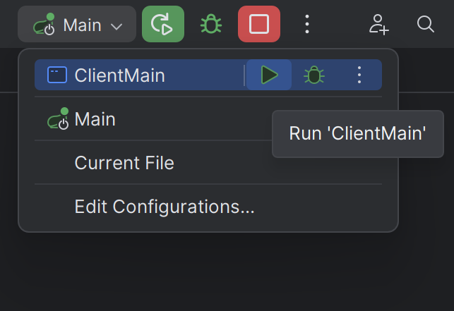

# OOPP Template Project

This repository contains the template for the OOPP project. Please extend this README.md with instructions on how to run your project.
# How to run the project
## Software prerequisites:
### How to install Java:
- Java 21(!) https://www.oracle.com/java/technologies/downloads/#java21
- Run java --version and check the output.
- Regardless of which Java JDK you have installed, Gradle will pick up the Java version
from your JAVA_HOME environment variable, so make sure it is set correctly
- Windows (Restart Required!)
https://superuser.com/questions/1057532/how-to-change-java-version-on-windows-10
- MacOS (use 21.0.2 instead of 17.0.1)
https://knasmueller.net/how-to-install-java-openjdk-17-on-macos-big-sur
### How to install JavaFX:
- https://openjfx.io/
- Download (SDK) (Match your Java JDK version)
- Unzip the downloaded SDK .zip somewhere (e.g., /path/to/javafx-sdk/)
- Make sure that this extracted path contains a “lib” folder
- Add VM Arguments to your Run Configs for the Client (note the “lib”!)
- To do this goto client/src/main/java/client and right click Main, click More Run/Debug and click Modify Run Configuration...

- This will Bring you to this menu

- For name put something like ClientMain and than press Modify options (blue link).
This will bring up a menu, select Add VM options from this menu.

- Once you have clicked this there will appear a new textfield VM options where you should put '--module-path="/path/to/javafx-sdk/lib" --add-modules=javafx.controls,javafx.fxml' 
- Make sure to change the /path/to/javafx-sdk/lib to the path of the unzipped javafx SDK and include /lib
- On Windows, you will like need to use backslashes (\) for the path
- Once you have filled this field in click apply and than click ok. If done correctly your configuration should appear in the top right of your screen.
- 

## Actually running the project: 

To Actually run the project follow these two simple steps:
- Go to server/src/main/java/server , rightclick Main and click Run 'Main'

This should start running the server and once you see the admin password in the console that opened up after a few second you can continue to the next step.

- Click the dropdown menu at the top right of your screen that now shows Main running. Now select ClientMain (Or the other name you gave the configuration) and click the green run button.

- A new window has now opened with the application running!
